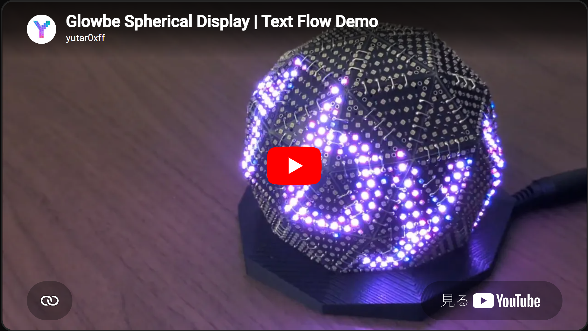
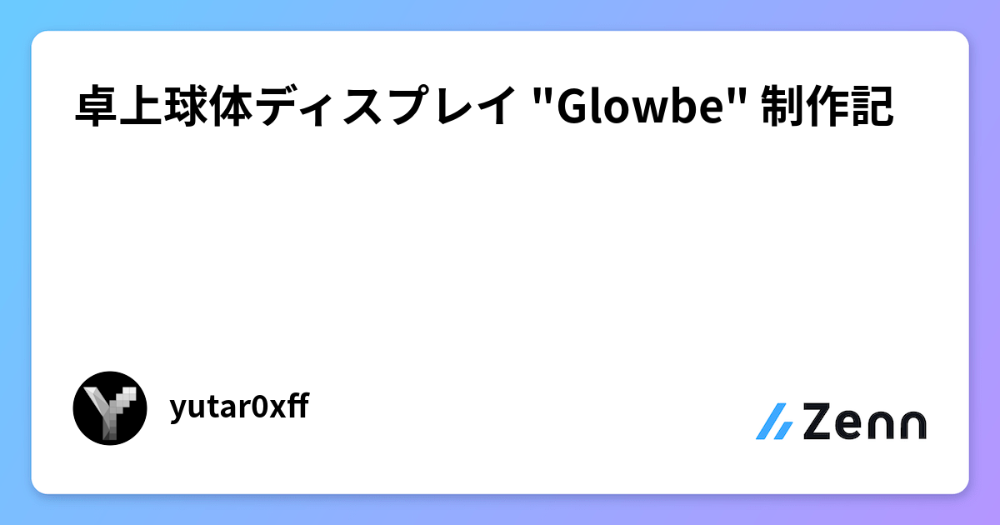

# Glowbe

<p align="center">
  <a href="https://www.youtube.com/playlist?list=PLaepnv5k-lJI">
    
  </a>
</p>

<p align="center">YouTube playlist: <a href="https://www.youtube.com/playlist?list=PLaepnv5k-lJI">Glowbe</a></p>

## 目次

- [What is Glowbe?](#what-is-glowbe)
- [制作動機](#制作動機)
- [制作手順](#制作手順)
- [機能](#機能)
  - [リアルタイム制御](#リアルタイム制御)
  - [モード](#モード)
  - [Chain profile エディタ](#chain-profile-エディタ)
- [技術仕様](#技術仕様)
  - [システム構成](#システム構成)
- [リポジトリ構成](#リポジトリ構成)
- [ドキュメント](#ドキュメント)
- [制作者](#制作者)
- [セキュリティ](#セキュリティ)
- [ライセンス](#ライセンス)
- [コントリビューション](#コントリビューション)
- [寄付](#寄付)
- [English](#what-is-glowbe-1)

---

## What is Glowbe?

**Glowbe**は、**glow する globe** — 卓上の球体 LED ディスプレイです。
近未来的インテリア、卓上に佇む相棒のようなデバイスを目指しています。

制作者の [yutar0xff (X @yutar0xff)](https://x.com/yutar0xff) はソフトウェア・ハードウェアともに素人です。各種 AI を利用しており、内容を十分に検証できていない部分があります。**自己責任でご利用ください。**

常日頃、私自身が様々なオープンソースプロジェクトの恩恵を受けているため、本プロジェクトもオープンソース化してみました。**ぜひフィードバックや改良してみたよという報告を心待ちにしております！** 使い方の質問なども気兼ねなくお尋ねください。

## 制作動機

- 卓上に相棒みたいなのがいたらいいな
- モノづくりしてます感のある DIY インテリアみたいなのがあったらいいな
- 就職先の電子部品メーカーの製品を使った何かを作ってみたい

## 制作手順

以下の記事にて写真付きで解説しています。質問等は気兼ねなくお尋ねください！

[](https://zenn.dev/yutar0xff/articles/5795aef5f19e7f)

https://zenn.dev/yutar0xff/articles/5795aef5f19e7f

## 機能

### リアルタイム制御

**Glowbe Studio**（Web UI）から **スマホやタブレット** でも操作でき、各種モード切替、インタラクティブエフェクト、Mateモードの表情変更など **リアルタイム制御** が可能です。

### モード

- Idle : 消灯
- Loop : 動画など、あらかじめ登録したコンテンツのループ再生
- Interactive : Glowbe Studio 上でインタラクティブに操作できるエフェクト
- Mate : 相棒のように表情を表示
- Text : 電光掲示板のように任意のテキストを表示

### Chain profile エディタ

複雑となるLEDの配線やレイアウトをエディタ上で簡単に編集できます。実機を組み立てた後、LEDの座標を手動で入力する必要はありません。

## 技術仕様

試作機の **15panels**（`icosahedron-15`、225 LED）版と本番機の **60panels**（`geodesic-2v-60`、1260 LED）の2つのバリエーションがあります。

### システム構成

LAN 上で **Glowbe Studio**、**Runtime**、**Glowbe 本体の ESP** が連携する **2 ノード構成**です（制御ホスト側に Studio と Runtime、実機側に ESP）。

- **Glowbe Studio** ↔ **Runtime**: HTTP / WebSocket
- **Runtime** ↔ **Glowbe 本体の ESP**: UDP

**Glowbe Studio** は Vite + React、**Runtime** は Rust で実装しています。

ソフトウェア（Runtime + Web UI）、ESP32 ファームウェア、基板・筐体データすべてをこのリポジトリで公開しています。

```
[Browser] Glowbe Studio  ── HTTP / WebSocket ──►  Runtime (Rust)
                                                      │
                                                     UDP
                                                      ▼
                                               Glowbe 本体 (ESP)
```

## リポジトリ構成

| パス | 内容 |
|------|------|
| [`runtime/`](runtime/) | 常駐サーバ（フレーム合成・UDP 送信・HTTP/WS API） |
| [`web/`](web/) | Glowbe Studio（Vite + React） |
| [`firmware/esp32/`](firmware/esp32/) | ESP32 ファーム（PlatformIO） |
| [`packages/core/`](packages/core/) | `@glowbe/core` — 幾何・LED レイアウト |
| [`config/layouts/`](config/layouts/) | レイアウト定義（`glowbe-layout` v1） |
| [`hardware/`](hardware/) | 基板（EasyEDA `.eprj`）・3D プリント |
| [`protocol/`](protocol/) | UDP・REST・レイアウト仕様 |
| [`docs/`](docs/) | 設計・セットアップ・ベンチ等 |

## ドキュメント

| ドキュメント | 内容 |
|-------------|------|
| [はじめに](docs/GETTING_STARTED.md) | ビルド・フラッシュ・起動 |
| [アーキテクチャ](docs/ARCHITECTURE.md) | システム設計 |
| [リリース概要](docs/STATUS.md) | 本リリースの機能一覧 |
| [開発メモ](docs/DEV.md) | ローカル開発の注意 |
| [環境変数](docs/ENV.md) | Web / デプロイ設定 |
| [Mate モード](docs/MATE.md) | 球面顔レンダラ |
| [ハードウェア](hardware/README.md) | PCB・3D プリント |

## 制作者

**yutar0xff** (ユータロー)と申します。

- X: [@yutar0xff](https://x.com/yutar0xff)
- Website: [yutar0xff.com](https://yutar0xff.com)

## セキュリティ

同一 LAN 内の信頼できるネットワーク向けです。HTTP / WebSocket / UDP に認証はありません。インターネットに公開しないでください。

## ライセンス

あまり詳しくないので、一旦は以下で公開します。ライセンスについてご相談等ありましたら、お気軽にお問い合わせください。

| 対象 | ライセンス |
|------|------------|
| ソフトウェア | [MIT](LICENSE) |
| ハードウェア（`hardware/`） | [CERN-OHL-P-2.0](LICENSE.hardware) |

詳細: [LICENSES.md](LICENSES.md)

## コントリビューション

Issue や Pull Request、フィードバックを歓迎します。使ってみた感想や改良報告もお待ちしています。

## 寄付

[](https://github.com/sponsors/yutar0xff)
[](https://ko-fi.com/yutar0xff)

Ko-fiやGitHub Sponsorsもはじめてみました（小声）
現在は修士論文に追われ、来年からは社会人なのもあり、今後の開発を保証はできないのですが、確実にモチベーションにはなると思います、、！

---

## Table of contents

- [What is Glowbe?](#what-is-glowbe-1)
- [Why I built it](#why-i-built-it)
- [Build guide](#build-guide)
- [Features](#features)
  - [Real-time control](#real-time-control)
  - [Modes](#modes)
  - [Chain profile editor](#chain-profile-editor)
- [Technical specs](#technical-specs)
  - [System architecture](#system-architecture)
- [Repository layout](#repository-layout)
- [Documentation](#documentation)
- [Author](#author)
- [Security](#security)
- [License](#license)
- [Contributing](#contributing)
- [Donations](#donations)

## What is Glowbe?

**Glowbe** is a **glowing globe** — a desktop LED spherical display.
I'm aiming for a futuristic interior piece and a little companion on your desk.

I'm [yutar0xff (X @yutar0xff)](https://x.com/yutar0xff), the creator. Both software and hardware are hobby work. I use various AI tools, and some content has not been fully verified. **Use at your own risk.**

I benefit from open source projects every day, so I open-sourced this one too. **I'd love your feedback or reports that you tried improving it!** Feel free to ask questions about how to use it.

## Why I built it

- I wanted a little companion on my desk
- I wanted DIY-style decor that feels handmade
- I wanted to build something using products from the electronic-components maker I will join

## Build guide

Step-by-step build notes with photos are in this article. Questions welcome!

[](https://zenn.dev/yutar0xff/articles/5795aef5f19e7f)

https://zenn.dev/yutar0xff/articles/5795aef5f19e7f

## Features

### Real-time control

From **Glowbe Studio** (web UI), you can control Glowbe from a **phone or tablet** — switch modes, run interactive effects, change Mate expressions, and more with **real-time control**.

### Modes

- Idle: lights off
- Loop: loop playback of pre-registered content such as video clips
- Interactive: effects you control interactively in Glowbe Studio
- Mate: companion-style facial expressions
- Text: display arbitrary text like an LED ticker

### Chain profile editor

Edit complex LED wiring and layout in the editor. After assembling the hardware, you don't need to enter LED coordinates by hand.

## Technical specs

Two variants: a prototype **15panels** (`icosahedron-15`, 225 LEDs) and a production **60panels** (`geodesic-2v-60`, 1260 LEDs).

### System architecture

On your LAN, **Glowbe Studio**, **Runtime**, and the **ESP on the Glowbe unit** work together in a **two-node setup** (Studio and Runtime on the control host, ESP on the device).

- **Glowbe Studio** ↔ **Runtime**: HTTP / WebSocket
- **Runtime** ↔ **ESP on the Glowbe unit**: UDP

**Glowbe Studio** is built with Vite + React; **Runtime** is built with Rust.

All software (Runtime + web UI), ESP32 firmware, and PCB / enclosure data are published in this repository.

```
[Browser] Glowbe Studio  ── HTTP / WebSocket ──►  Runtime (Rust)
                                                      │
                                                     UDP
                                                      ▼
                                               Glowbe unit (ESP)
```

## Repository layout

| Path | Contents |
|------|----------|
| [`runtime/`](runtime/) | Daemon (frame synthesis, UDP, HTTP/WS API) |
| [`web/`](web/) | Glowbe Studio (Vite + React) |
| [`firmware/esp32/`](firmware/esp32/) | ESP32 firmware (PlatformIO) |
| [`packages/core/`](packages/core/) | `@glowbe/core` — geometry & LED layout |
| [`config/layouts/`](config/layouts/) | Layout definitions (`glowbe-layout` v1) |
| [`hardware/`](hardware/) | PCB (EasyEDA `.eprj`) & 3D print files |
| [`protocol/`](protocol/) | UDP, REST, and layout specs |
| [`docs/`](docs/) | Design, setup, benchmarks, etc. |

## Documentation

| Document | Contents |
|----------|----------|
| [Getting started](docs/GETTING_STARTED.md) | Build, flash, and run |
| [Architecture](docs/ARCHITECTURE.md) | System design |
| [Release overview](docs/STATUS.md) | Features in this release |
| [Development notes](docs/DEV.md) | Local dev tips |
| [Environment variables](docs/ENV.md) | Web / deploy config |
| [Mate mode](docs/MATE.md) | Spherical face renderer |
| [Hardware](hardware/README.md) | PCB & 3D print |

## Author

I'm **yutar0xff** (Yutaro).

- X: [@yutar0xff](https://x.com/yutar0xff)
- Website: [yutar0xff.com](https://yutar0xff.com)

## Security

Intended for a trusted LAN. HTTP, WebSocket, and UDP have no authentication. Do not expose to the internet.

## License

I'm not very familiar with licensing, so for now I'm publishing under the following. If you have questions or want to discuss licensing, feel free to reach out.

| Scope | License |
|-------|---------|
| Software | [MIT](LICENSE) |
| Hardware (`hardware/`) | [CERN-OHL-P-2.0](LICENSE.hardware) |

See [LICENSES.md](LICENSES.md).

## Contributing

Issues, pull requests, and feedback are welcome. We'd also love to hear how you used it or what you improved.

## Donations

[](https://github.com/sponsors/yutar0xff)
[](https://ko-fi.com/yutar0xff)

I just started Ko-fi and GitHub Sponsors (quietly). I'm swamped with my master's thesis right now, and I'll be working full-time starting next year, so I can't promise continued development—but support would definitely be motivating!
