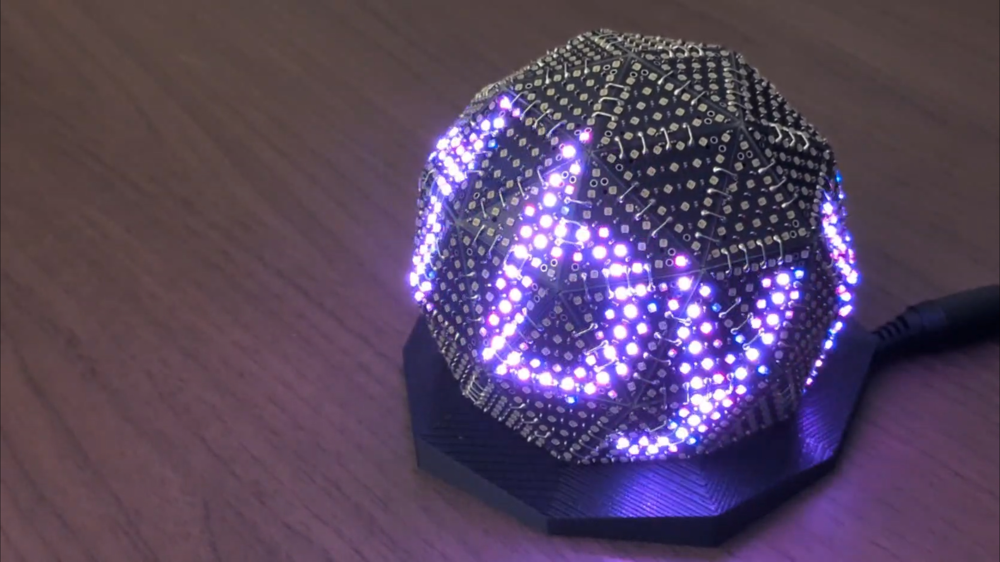

# Glowbe

<p align="center">
  
</p>

---

## Glowbe とは

**Glowbe**は、**glow する globe** — 卓上の球体 LED ディスプレイです。
将来的には、近未来的インテリア兼、卓上に佇む相棒のような存在にできたらいいなと思っています。

LAN 上の **中継サーバ（`glowbe-runtime`）** がアニメーションを合成し、ESP32 球体へ UDP で送ります。**Glowbe Studio**（Web UI）から **スマホやタブレット** でも操作でき、モード切替・インタラクティブ・Mate 表情など **リアルタイム制御** が可能です。

ソフトウェア（Rust ランタイム + Web UI）、ESP32 ファームウェア、基板・筐体データをひとつのリポジトリで公開しています。

## デモ動画

YouTube プレイリスト: [Glowbe](https://www.youtube.com/playlist?list=PLaepnv5k-lJI)

## 制作動機

- 卓上に相棒みたいなのがいたらいいな
- モノづくりしてます感のある DIY インテリアみたいなのがあったらいいな
- 就職先の電子部品メーカーの製品を使った何かを作ってみたい

## システム概要

```
スマホ / タブレット / PC
        │
        ▼
Web（Glowbe Studio）  ── HTTP / WebSocket ──►  glowbe-runtime（Rust・中継）
                                                      │
                                              Glowbe Wire UDP
                                                      ▼
                                              ESP32 + LED 球体
```

- **15panels**（`icosahedron-15`、225 LED）と **60panels**（`geodesic-2v-60`、1260 LED）の 2 バリアント
- モード例: ループ再生、インタラクティブ、**Mate**（相棒）、Idle
- Chain profile エディタで配線・レイアウトを編集可能

## リポジトリ構成

| パス | 内容 |
|------|------|
| [`runtime/`](runtime/) | 常駐サーバ（フレーム合成・UDP 送信・HTTP/WS API） |
| [`web/`](web/) | Glowbe Studio（Vite + React） |
| [`firmware/esp32/`](firmware/esp32/) | ESP32 ファーム（PlatformIO） |
| [`packages/core/`](packages/core/) | `@glowbe/core` — 幾何・LED レイアウト |
| [`config/layouts/`](config/layouts/) | レイアウト定義（`glowbe-layout` v1） |
| [`hardware/`](hardware/) | 基板（EasyEDA `.eprj`）・3D プリント |
| [`protocol/`](protocol/) | UDP・REST・レイアウト仕様 |
| [`docs/`](docs/) | 設計・セットアップ・ベンチ等 |

## ドキュメント

| ドキュメント | 内容 |
|-------------|------|
| [はじめに](docs/GETTING_STARTED.md) | ビルド・フラッシュ・起動 |
| [アーキテクチャ](docs/ARCHITECTURE.md) | システム設計 |
| [リリース概要](docs/STATUS.md) | 本リリースの機能一覧 |
| [開発メモ](docs/DEV.md) | ローカル開発の注意 |
| [環境変数](docs/ENV.md) | Web / デプロイ設定 |
| [Mate モード](docs/MATE.md) | 球面顔レンダラ |
| [ハードウェア](hardware/README.md) | PCB・3D プリント |

## 制作者

**yutar0xff** — [X (@yutar0xff)](https://x.com/yutar0xff)

ソフト・ハードともに素人制作です。AI 支援を利用しており、内容を十分に検証できていない部分があります。**自己責任でご利用ください。**

日頃オープンソースの恩恵を受けているため、本プロジェクトもオープンソース化しています。

## セキュリティ

同一 LAN 内の信頼できるネットワーク向けです。HTTP / WebSocket / UDP に認証はありません。インターネットに公開しないでください。

## ライセンス

| 対象 | ライセンス |
|------|------------|
| ソフトウェア | [MIT](LICENSE) |
| ハードウェア（`hardware/`） | [CERN-OHL-P-2.0](LICENSE.hardware) |

詳細: [LICENSES.md](LICENSES.md)

## コントリビューション

Issue や Pull Request、フィードバックを歓迎します。使ってみた感想や改良報告もお待ちしています。

## 寄付

[](https://github.com/sponsors/yutar0xff)
[](https://ko-fi.com/yutar0xff)

**今後も開発を続ける保証はありません。** 現公開に対するチップとしてのみ受け付けます。返礼や特典、開発スケジュールの約束はありません。

---

## What is Glowbe?

**Glowbe** is a **glowing globe** — a desktop LED spherical display.
Someday I hope it feels like a little futuristic companion sitting on your desk.

A **relay server (`glowbe-runtime`)** on your LAN synthesizes animation frames and sends them to the ESP32 sphere over UDP. **Glowbe Studio** (web UI) lets you control it from a **phone or tablet** on the same network — mode changes, interactive taps, Mate expressions, and other **real-time control**.

This repository publishes the software (Rust runtime + web UI), ESP32 firmware, LED layout definitions, and PCB / enclosure data together.

## Demo videos

YouTube playlist: [Glowbe](https://www.youtube.com/playlist?list=PLaepnv5k-lJI)

## Why I built it

- I wanted a little companion on my desk
- I wanted DIY-style decor that feels handmade
- I wanted to build something using products from the electronic-components maker I will join

## System overview

```
Phone / tablet / PC
        │
        ▼
Web (Glowbe Studio)  ── HTTP / WebSocket ──►  glowbe-runtime (Rust relay)
                                                  │
                                          Glowbe Wire UDP
                                                  ▼
                                          ESP32 + LED sphere
```

- Two rig variants: **15panels** (`icosahedron-15`, 225 LEDs) and **60panels** (`geodesic-2v-60`, 1260 LEDs)
- Modes include loop playback, interactive, **Mate** (companion face), and idle
- Chain profile editor for wiring and layout customization

## Repository layout

| Path | Contents |
|------|----------|
| [`runtime/`](runtime/) | Daemon (frame synthesis, UDP, HTTP/WS API) |
| [`web/`](web/) | Glowbe Studio (Vite + React) |
| [`firmware/esp32/`](firmware/esp32/) | ESP32 firmware (PlatformIO) |
| [`packages/core/`](packages/core/) | `@glowbe/core` — geometry & LED layout |
| [`config/layouts/`](config/layouts/) | Layout definitions (`glowbe-layout` v1) |
| [`hardware/`](hardware/) | PCB (EasyEDA `.eprj`) & 3D print files |
| [`protocol/`](protocol/) | UDP, REST, and layout specs |
| [`docs/`](docs/) | Design, setup, benchmarks, etc. |

## Documentation

| Document | Contents |
|----------|----------|
| [Getting started](docs/GETTING_STARTED.md) | Build, flash, and run |
| [Architecture](docs/ARCHITECTURE.md) | System design |
| [Release overview](docs/STATUS.md) | Features in this release |
| [Development notes](docs/DEV.md) | Local dev tips |
| [Environment variables](docs/ENV.md) | Web / deploy config |
| [Mate mode](docs/MATE.md) | Spherical face renderer |
| [Hardware](hardware/README.md) | PCB & 3D print |

## Author

**yutar0xff** — [X (@yutar0xff)](https://x.com/yutar0xff)

Both software and hardware are hobby work. AI assistance is involved, and some content has not been fully verified. **Use at your own risk.**

I benefit from open source every day, so I open-sourced this project too.

## Security

Intended for a trusted LAN. HTTP, WebSocket, and UDP have no authentication. Do not expose to the internet.

## License

| Scope | License |
|-------|---------|
| Software | [MIT](LICENSE) |
| Hardware (`hardware/`) | [CERN-OHL-P-2.0](LICENSE.hardware) |

See [LICENSES.md](LICENSES.md).

## Contributing

Issues, pull requests, and feedback are welcome. Reports of how you tried it or improved it are welcome too.

## Donations

[](https://github.com/sponsors/yutar0xff)
[](https://ko-fi.com/yutar0xff)

**There is no guarantee of continued development.** Donations are accepted only as tips for the currently published release. No perks, rewards, or development schedule is promised.
